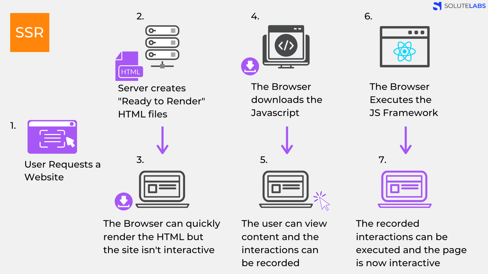

# SSR의 정의와 설명

---

<aside>
💡 Server Side Rendering의 약자

</aside>

## 단계

1. User가 Website 요청을 보냄
2. Server는 ‘Ready to Render’ 즉, 즉시 렌더링 가능한 html 파일을 만든다.
3. 클라이언트에 전달되는 순간, 이미 렌더링 준비가 되어있기 때문에 HTML은 즉시 렌더링 된다. 그러나 사이트 자체는 조작 불가능하다. (JavaScript 가 읽히기 전)
4. 클라이언트가 자바스크립트를 다운받는다.
5. 다운 받아지고 있는 사이에 유저는 컨텐츠는 볼 수 있지만 사이트를 조작 할 수는 없다.
   이때의 사용자 조작을 기억하고 있는다.
6. 브라우저가 JavaScript 프레임워크를 실행한다.
7. JS까지 성공적으로 컴파일 되었기 때문에 기억하고 있던 사용자 조작이 실행되고 이제 웹 페이지는 상호작용 가능해진다.

# CSR의 정의와 설명

<aside>
💡 Client Side Rendering의 약자

</aside>

1. User가 Website 요청을 보냄
2. CDN이 HTML 파일과 JS로 접근할 수 있는 링크를 클라이언트로 보낸다.
3. 클라이언트는 HTML과 JS를 다운로드 받는다.
   ( 이때 SSR과 달리 유저는 아무것도 볼 수 없다 )
4. 다운이 완료된 JS가 실행된다. 데이터를 위한 API가 호출된다.
5. 서버가 API로부터의 요청에 응답한다.
   ( 이때 유저들은 placeholder 를 보게된다
6. API로부터 받아온 data를 placeholder 자리에 넣어준다. 이제 페이지는 상호작용이 가능해진다

# 차이점

## SSR

- 장점
  1. SEO , 검색엔진 최적화에 유리하다.
  2. 빠른 초기 로딩
- 단점
  1. 사용자 경험
     1. TTV( Time To View ) 와 TTI( Time To Interact ) 간에 시간 간격
     2. 요청시 마다 새로고침 → 깜빡임
  2. 서버 부하 : 페이지 전체를 서버에서 렌더링하기때문에 요청이 많으면 부하 위험이있다.

## CSR

- 장점
  1. 빠른 속도 (페이지 이동간)
  2. 서버 부하 감소 → 변경된 데이터만 렌더링하기 때문
  3. 사용자 친화적 → 깜빡임 X
- 단점
  1. SEO 불리
     1. 웹 크롤러는 자바스크립트를 읽지 못한다 → 빈 페이지로 인식된다
  2. 초기로딩 속도가 느리다 → 모든 JS파일을 다운 받아야된다.

# 선택 기준

### SSR

- 네트워크가 느릴 때
- SEO가 필요 할 때
- 최초 로딩이 빨라야하는 사이트를 개발 할 때
- 메인 스크립트가 크고 로딩이 매우 느릴 때

<aside>
💡 CSR은 메인스크립트가 로딩이 끝나면 API로 데이터 요청을 보낸다.

</aside>

- 웹 사이트가 상호작용이 별로 없을 때

### CSR

- 네트워크가 빠를 때
- 서버의 성능이 좋지 않을 때
- 사용자에게 보여줘야 하는 데이터의 양이 많을 때
- 메인 스크립트가 가벼울 때
- SEO가 필요하지 않을 때
- 사용자와 상호작용할 것들이 많을 떄.
  ( 렌더링 되지 않아서 사용자 행동을 막는 것이 경험에 오히려 유리하다)

# \***\*Universal Rendering\*\***

<aside>
💡 SSR 과 CSR의 절충안

</aside>

- 초기화면은 SSR로 서버에서 렌더링하여 초기 지연시간을 줄인다.
- 이후 부터는 CSR 방식으로 필요한 데이터 부분만 갱신하여 서버의 부하를 줄인다.
- SEO에도 유리하다.
- React는 Next.js Vue는 Nuxt.js라는 프레임워크로 구현할 수 있다
